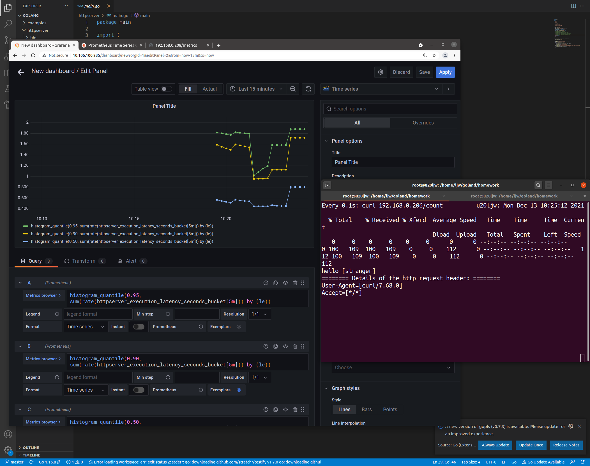
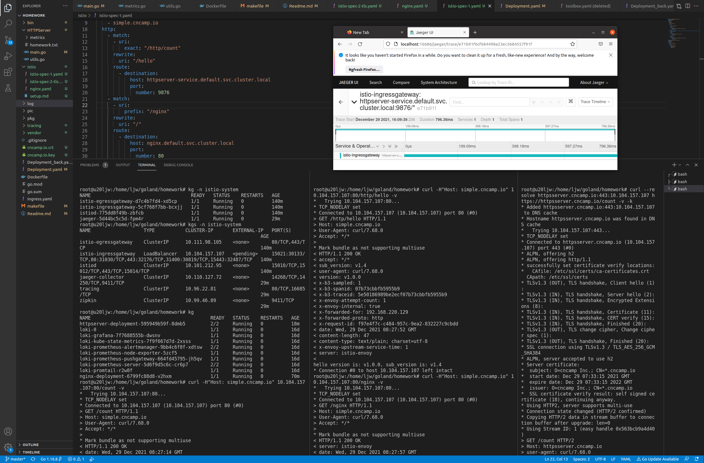

## 1009模块三作业

1. 创建Dockerfile文件，编写，两端构建
2. docker build -t httpserver:v1.0.0 .
3. docker run -d --name ht -P httpserver:v1.0.0
4. docker inspect 查看容器PID
5. 使用nsenter 进入但是没有任何指令（top、ps、hostname等），可能是因为使用了scrach镜像作为运行的基镜像，后来修改为go的镜像
6. sudo nsenter -a -t $PID hostname 查看容器所在namespace的hostname和容器ID一致
7. docker tag httpserver:v1.0.0 wxwd14388/httpserver:v1.0.0 (sudo make release)
8. docker login
9. docker push wxwd14388/httpserver:v1.0.0 (sudo make push)

## 1128 module 8 homework

1. create Deployment.yaml for normal deploy
2. add livenessProbe and some test
3. add postStart and preStop
4. add config.ini from volume and get from /getData
5. add service through ClusterIP(curl 10.104.5.137:9876/getData) and NodePort(curl localhost:30080/getData)
6. ingress not success, try later

## 1212 module 10 homework

1. add /metrics access url
2. add /count access url for delay count
3. modify Deployment.yaml for prometheus Scrape

## 12.26 module 11 homework

1. install istio (wget, tar, ...)
2. apply Deployment.yaml, create istio/istio-space.yaml, apply istio/nginx.yaml
3. 7-level routing in istio/istio-space.yaml

